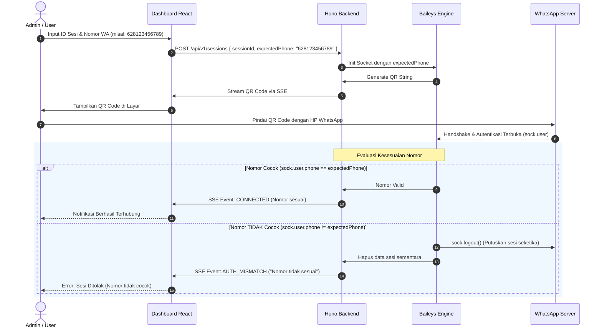

# Product Requirement Document (PRD)
## WAGate - Multi-Session WhatsApp Gateway & Management Dashboard

| Metadata | Keterangan |
| :--- | :--- |
| **Nama Proyek** | **WAGate** (WhatsApp Gateway & Automation Engine) |
| **Versi** | 2.6.0 |
| **Status** | Approved by User (Updated with TDD Methodology & Vitest) |
| **Core WhatsApp Engine** | `@whiskeysockets/baileys` |
| **Backend Framework** | **Hono** (`hono` + `@hono/node-server`) |
| **Frontend Framework** | **React + Vite + TypeScript + Tailwind CSS** |
| **Penyimpanan Sesi** | **Pluggable**: File Lokal (`useMultiFileAuthState`) & **MongoDB Database** |
| **Penyimpanan Pesan & Antrean** | **MongoDB** (`whatsapp_messages`) & File Media Lokal |
| **Inbound Action Engine** | **Modular Code-Based Handlers** (`MessageContext` Pipeline) |
| **Keamanan Autentikasi** | **Strict Phone Matching** (Wajib input nomor sebelum scan & tolak jika beda) |
| **Komunikasi Real-time**| Server-Sent Events (SSE) via Hono Streaming |

---

## 1. Latar Belakang & Tujuan (Background & Objective)

### 1.1 Latar Belakang
Kebutuhan operasional modern (seperti Customer Service, Sales, Notifikasi Transaksi) sering kali menuntut penggunaan **lebih dari satu nomor WhatsApp** dalam satu infrastruktur. WhatsApp Cloud API resmi memiliki batasan biaya per percakapan, sedangkan otomatisasi berbasis browser (Puppeteer/Chromium) memakan resource memori yang boros (500MB – 1GB per akun).

Solusi yang dirancang adalah **Multi-Session WhatsApp Gateway & Management Dashboard** menggunakan **Baileys** yang berjalan di atas backend ultra-cepat **Hono** dan dashboard modern **React + Vite**. Sistem ini mampu mengelola banyak akun WhatsApp sekaligus secara terisolasi, hemat sumber daya (~30MB RAM per akun), mendukung penyimpanan sesi di **MongoDB**, mengelola antrean pesan keluar persisten (*Queue Manager*), menyimpan riwayat pesan & media, menyediakan **pipeline handler berbasis kode (*Code-Based Handlers*)**, serta menerapkan **validasi nomor telepon ketat (*Strict Phone Number Verification*)** saat penautan QR code untuk memastikan hanya nomor yang sah yang dapat terhubung.

### 1.2 Tujuan Utama
1. **Multi-Account / Multi-Session**: Mengelola banyak akun WhatsApp sekaligus dalam satu aplikasi tanpa konflik data.
2. **Validasi Nomor Ketat (*Strict Phone Verification*)**: Pengguna wajib menginput nomor telepon target sebelum QR Code digenerate. Jika nomor WhatsApp yang memindai QR berbeda dengan nomor yang diinput, sesi seketika di-logout, dibatalkan, dan dibersihkan dari sistem.
3. **Pluggable Session Storage (File & MongoDB)**:
   * **Mode File**: Ideal untuk pengembangan lokal cepat tanpa perlu database.
   * **Mode MongoDB**: Sesi tersimpan aman di database sehingga ramah deployment cloud/Docker (*stateless container*).
4. **Inbound Action Handlers (Modular Code Pipeline)**:
   * Developer dapat membuat logika penanganan pesan kustom secara modular di folder `src/inbound/handlers/`.
   * Objek `MessageContext` menyediakan helper siap pakai: `ctx.reply()`, `ctx.replyImage()`, `ctx.react()`, `ctx.simulateTyping()`, dan `ctx.markRead()`.
5. **Anti-Ban Safe Queue & Manajemen Antrean (Queue Manager)**:
   * Antrean pesan persisten di MongoDB dengan jeda dinamis acak (*jitter delay*).
   * Kemampuan membaca antrean (*inspect queue*) dan membatalkan pesan antrean (*cancel/delete queue*).
6. **Penyimpanan Riwayat Pesan (Message Store & Media)**:
   * Menyimpan semua pesan masuk (*inbound*) dan keluar (*outbound*) ke MongoDB.
   * Mengunduh dan mengelola file media dengan URL streaming lokal.
   * Melacak status centang pengiriman (*receipts*: queued, pending, sent ✓, delivered ✓✓, read ✓✓ biru, cancelled).
7. **Dashboard Visual (React + Vite)**: Web dashboard untuk memantau status multi-akun, scan QR live dengan validasi nomor, pairing code, antrean pesan keluar, dan riwayat chat.
8. **Outbound Messaging Terprogram**: REST API berbasis Hono untuk mengirim teks, media, dokumen, dan reaksi dengan parameter `:sessionId`.

---

## 2. Arsitektur & Alur Autentikasi Ketat (Authentication Flow)



---

## 3. Struktur Direktori Proyek (Project Structure)

```text
./
├── sessions/                       # Direktori sesi jika mode 'file' aktif
│   ├── cs-utama/                   
│   └── sales-team/                 
├── storage/                        # Direktori penyimpanan file media yang diunduh
│   └── media/
├── src/                            # BACKEND (Hono + Baileys)
│   ├── config/                     # Konfigurasi aplikasi & database
│   │   └── app.config.ts
│   ├── core/
│   │   ├── auth/                   # Modul Penyimpanan Sesi (Pluggable)
│   │   │   ├── auth.interface.ts   # Kontrak interface auth state
│   │   │   ├── file.auth.ts        # Driver penyimpanan berbasis File
│   │   │   └── mongo.auth.ts       # Driver penyimpanan berbasis MongoDB
│   │   ├── session.manager.ts      # Registry & Lifecycle Multi-Akun (Strict Verification)
│   │   └── session.instance.ts     # Wrapper koneksi Baileys per akun
│   ├── database/                   # Modul Database & Persistence Pesan
│   │   ├── mongo.client.ts         # Koneksi MongoDB Driver
│   │   ├── message.schema.ts       # Definisi skema pesan MongoDB
│   │   └── message.store.ts        # Service CRUD riwayat percakapan & antrean
│   ├── media/                      # Modul Unduh & Pengelolaan Media
│   │   └── media.service.ts        # Helper downloadMediaMessage & local save
│   ├── inbound/
│   │   ├── context.ts              # Kelas MessageContext (helper aksi ctx.reply, dll)
│   │   ├── handler.interface.ts    # Interface definisi handler (matcher & action)
│   │   ├── message.parser.ts       # Normalisasi payload pesan Baileys
│   │   ├── message.router.ts       # Router orkestrator pipeline handler
│   │   └── handlers/               # Kumpulan handler aksi berbasis kode
│   │       ├── ping.handler.ts     # Contoh handler command !ping
│   │       ├── menu.handler.ts     # Contoh handler menu info
│   │       └── webhook.handler.ts  # Handler penerusan ke webhook eksternal
│   ├── outbound/
│   │   ├── message.sender.ts       # Helper kirim teks, media, reaksi
│   │   ├── message.queue.ts        # Safe queue worker dengan delay jitter
│   │   └── queue.manager.ts        # Pengelolaan antrean (baca, batalkan, bersihkan)
│   ├── api/
│   │   ├── routes/
│   │   │   ├── session.routes.ts   # Endpoint CRUD akun, QR, dan SSE
│   │   │   ├── message.routes.ts   # Endpoint kirim & riwayat pesan
│   │   │   ├── queue.routes.ts     # Endpoint manajemen antrean pesan
│   │   │   └── media.routes.ts     # Endpoint streaming file media lokal
│   │   └── server.ts               # Hono App, CORS, & Serve Static Frontend
│   └── index.ts                    # Entry point backend
├── frontend/                       # FRONTEND (React + Vite + Tailwind)
│   ├── src/
│   │   ├── components/
│   │   │   ├── SessionCard.tsx     # Card status akun di dashboard
│   │   │   ├── QrModal.tsx         # Modal QR Code live dengan verifikasi nomor
│   │   │   ├── AddSessionModal.tsx # Modal form tambah akun baru (input sessionId & phone)
│   │   │   ├── MessageTester.tsx   # Sandbox test kirim pesan per akun
│   │   │   ├── QueueManager.tsx    # Manajemen antrean (tabel antrean & tombol batalkan)
│   │   │   └── ChatViewer.tsx      # Tampilan riwayat chat per kontak
│   │   ├── hooks/
│   │   │   └── useSessionEvents.ts # Hook SSE untuk live update status/QR
│   │   ├── App.tsx
│   │   └── main.tsx
│   ├── vite.config.ts              # Proxy /api ke port backend (Hono)
│   └── package.json
├── package.json                    # Root package.json
├── tsconfig.json
├── .env.example
├── .gitignore
└── PRD.md
```

---

## 4. Kebutuhan Fungsional (Functional Requirements)

### 4.1 Modul 1: Manajemen Multi-Sesi & Validasi Nomor Ketat
* **FR-1.1 Pendaftaran Akun dengan Nomor Target Wajib**:
  * Pengguna wajib memasukkan `sessionId` dan `expectedPhoneNumber` (format nomor internasional, misal: `628123456789`).
  * Sistem memvalidasi keunikan `sessionId` dan format nomor telepon sebelum QR digenerate.
* **FR-1.2 Validasi Nomor Telepon Ketat (*Strict Matching Verification*)**:
  * Saat event `connection.update` beralih ke status `open`, sistem mengambil nomor asli dari `sock.user.id`.
  * Sistem menormalisasi kedua nomor dan membandingkannya:
    * **Jika Cocok**: Status diubah ke `CONNECTED`, data sesi disimpan permanen, profil akun dicatat di database, dan event sukses dikirim ke frontend via SSE.
    * **Jika Beda**: Sistem seketika memanggil `sock.logout()`, menghapus file/data sesi sementara, menandai status sebagai `REJECTED`, dan mengirim notifikasi error ke frontend via SSE.
* **FR-1.3 Dua Driver Penyimpanan Sesi**:
  * **Driver File (`SESSION_STORAGE=file`)**: Direktori `./sessions/<sessionId>/`.
  * **Driver MongoDB (`SESSION_STORAGE=mongodb`)**: Koleksi `whatsapp_sessions` dengan `BufferJSON`.
* **FR-1.4 Dua Metode Autentikasi**: QR Code visual via SSE dan Pairing Code 8 digit (keduanya memvalidasi nomor).
* **FR-1.5 Isolasi Sesi & Auto-Reconnect**: Auto-reconnect mandiri per akun dengan exponential backoff.
* **FR-1.6 Penghapusan Sesi**: Unlink dan bersihkan file/dokumen sesi dari storage.

### 4.2 Modul 2: Pengiriman Pesan & Manajemen Antrean (Queue Manager)
* **FR-2.1 Endpoint Berparameter `:sessionId`**: Outbound URL `/api/v1/sessions/:sessionId/messages/text`.
* **FR-2.2 Format Pesan**: Teks (biasa/mention/quote reply), Media (gambar/video/audio VN/dokumen), Reaksi emoji.
* **FR-2.3 Persistent Safe Queue (Anti-Ban)**:
  * Status awal `"queued"`, respon API langsung `202 Accepted` + `queueId`.
  * Worker memproses satu per satu dengan jeda dinamis acak (1500ms – 3000ms).
  * Auto-pause saat koneksi putus, auto-resume saat tersambung kembali.
* **FR-2.4 Manajemen & Pembatalan Antrean (Queue Management)**:
  * **Membaca Antrean**: `GET /api/v1/sessions/:sessionId/queue`.
  * **Membatalkan Pesan**: `DELETE /api/v1/sessions/:sessionId/queue/:queueId` (status diubah `"cancelled"`, dilewati oleh worker).
  * **Mengosongkan Semua Antrean**: `DELETE /api/v1/sessions/:sessionId/queue`.

### 4.3 Modul 3: Pengelolaan Pesan Masuk & Code-Based Action Handlers
* **FR-3.1 Normalisasi Payload Pesan Masuk**: Format JSON standar menyertakan `sessionId`.
* **FR-3.2 Objek `MessageContext`**:
  * Properti: `sessionId`, `messageId`, `from`, `sender`, `senderName`, `text`, `type`, `isGroup`, `quoted`, `raw`.
  * Helper Aksi Langsung:
    * `await ctx.reply(text)`: Balas quote pesan pengirim.
    * `await ctx.replyImage(urlOrBuffer, caption?)`: Balas dengan gambar.
    * `await ctx.replyDocument(urlOrBuffer, fileName, mimetype, caption?)`: Balas dengan dokumen.
    * `await ctx.react(emoji)`: Berikan emoji reaksi ke pesan.
    * `await ctx.simulateTyping(durationMs?)`: Simulasi efek sedang mengetik.
    * `await ctx.markRead()`: Tandai pesan terbaca (centang biru).
* **FR-3.3 Interface Handler Berbasis Kode (`MessageHandler`)**:
  * Pola struktur modular di `src/inbound/handlers/` dengan fungsi `matcher(ctx)` dan `action(ctx)`.
* **FR-3.4 Penyimpanan Pesan ke Database (Message Store)**:
  * Jika `SAVE_MESSAGES_TO_DB=true`, pesan dicatat di MongoDB `whatsapp_messages`.
* **FR-3.5 Pengunduhan Media Otomatis**:
  * Jika `AUTO_DOWNLOAD_MEDIA=true`, media diunduh ke `./storage/media/<sessionId>/`.
* **FR-3.6 Pelacakan Status Centang Pesan**:
  * Event `message-receipt.update` memperbarui status pengiriman di database.

### 4.4 Modul 4: Frontend Dashboard (React + Vite)
* **FR-4.1 Tampilan Beranda Multi-Akun**: Grid card status akun (🟢 Connected, 🟡 Waiting QR / Pairing, 🔴 Disconnected).
* **FR-4.2 Modal Tambah & Login Akun**:
  * Input wajib: `ID Sesi` dan `Nomor Telepon Target`.
  * Live QR Scanner via SSE atau input Pairing Code.
  * Tampilan error jika scan dilakukan oleh nomor yang tidak sesuai.
* **FR-4.3 Informasi Profil Akun & Chat Viewer**: Profil WhatsApp dan riwayat chat per kontak.
* **FR-4.4 Manajemen Antrean Pesan (Queue Manager UI)**: Tabel antrean pesan pending dengan tombol Batalkan / Kosongkan.
* **FR-4.5 Sandbox Uji Coba Pesan (Test Console)**: Form uji coba kirim pesan dari akun terpilih.

---

## 5. Konfigurasi Environment (`.env`)

```env
# Server
PORT=3000
API_KEY=secret-token-12345

# Session Storage Mode ('file' atau 'mongodb')
SESSION_STORAGE=mongodb
MONGODB_URI=mongodb://localhost:27017/whatsapp_gateway

# Message & Media Persistence
SAVE_MESSAGES_TO_DB=true
AUTO_DOWNLOAD_MEDIA=true
MEDIA_STORAGE_DIR=./storage/media

# Queue Settings
QUEUE_MIN_DELAY_MS=1500
QUEUE_MAX_DELAY_MS=3000

# Inbound Webhook (Opsional)
WEBHOOK_URL=https://my-backend.com/webhook/whatsapp
```

---

## 6. Spesifikasi REST API & Server-Sent Events (SSE)

### 6.1 Manajemen Sesi & Autentikasi
| Method | Endpoint | Deskripsi |
| :--- | :--- | :--- |
| `GET` | `/api/v1/sessions` | Mendapatkan daftar seluruh sesi dan statusnya |
| `POST` | `/api/v1/sessions` | Membuat sesi baru dengan validasi nomor (`{ "sessionId": "sales", "expectedPhone": "628123456789" }`) |
| `GET` | `/api/v1/sessions/:sessionId/status` | Mengecek status koneksi akun tertentu |
| `GET` | `/api/v1/sessions/:sessionId/events` | **Stream SSE** untuk live status, QR update, penolakan nomor, dan profil |
| `POST` | `/api/v1/sessions/:sessionId/pairing-code` | Meminta kode pairing 8 digit (`{ "phoneNumber": "62812..." }`) |
| `POST` | `/api/v1/sessions/:sessionId/restart` | Merestart koneksi socket akun tertentu |
| `DELETE` | `/api/v1/sessions/:sessionId` | Logout dan hapus sesi (dari file atau MongoDB) |

### 6.2 Pengiriman & Riwayat Pesan
| Method | Endpoint | Deskripsi |
| :--- | :--- | :--- |
| `POST` | `/api/v1/sessions/:sessionId/messages/text` | Mengantrikan pengiriman pesan teks / reply |
| `POST` | `/api/v1/sessions/:sessionId/messages/media` | Mengantrikan pengiriman media (gambar/video/dokumen) |
| `POST` | `/api/v1/sessions/:sessionId/messages/reaction` | Mengirim emoji reaksi |
| `GET` | `/api/v1/sessions/:sessionId/messages` | Mengambil riwayat pesan (filter: `contact`, `page`, `limit`) |
| `GET` | `/api/v1/sessions/:sessionId/media/:fileName` | Mengakses / stream file media yang diunduh |

### 6.3 Manajemen Antrean Pesan (Queue API)
| Method | Endpoint | Deskripsi |
| :--- | :--- | :--- |
| `GET` | `/api/v1/sessions/:sessionId/queue` | Melihat seluruh daftar pesan yang sedang mengantre |
| `GET` | `/api/v1/sessions/:sessionId/queue/:queueId` | Melihat detail spesifik 1 pesan di antrean |
| `DELETE` | `/api/v1/sessions/:sessionId/queue/:queueId` | Membatalkan pengiriman 1 pesan di antrean |
| `DELETE` | `/api/v1/sessions/:sessionId/queue` | Mengosongkan seluruh pesan di antrean akun tersebut |

---

## 7. Kebutuhan Non-Fungsional (Non-Functional Requirements)

1. **Efisiensi Memori & Skalabilitas**: RAM ~30 MB per akun. File media disimpan di disk/storage lokal dengan streaming on-demand.
2. **Keamanan (Security)**: Endpoint dilindungi header `x-api-key`. Sesi yang tidak cocok langsung di-revoke secara permanen via `sock.logout()`.
3. **Pengalaman Pengembang (Developer Experience)**:
   * Menambahkan handler aksi baru cukup dengan membuat 1 file baru di `src/inbound/handlers/`.
   * Hot Module Replacement (HMR) cepat di Vite. Backend auto-reload dengan `tsx watch`.

---

## 8. Metodologi Pengujian & Test-Driven Development (TDD)

Proyek ini dibangun menggunakan disiplin **TDD (Red - Green - Refactor)**:
1. **🔴 RED**: Setiap modul wajib diawali dengan penulisan unit test / integration test yang mendefinisikan kontrak fungsional (tes awal gagal).
2. **🟢 GREEN**: Implementasi kode dibuat seminimal mungkin agar tes lulus 100%.
3. **🔵 REFACTOR**: Kode dibersihkan dan dioptimasi dengan jaminan tes tetap hijau.

### Matriks Pengujian Otomatis (Vitest):
* **Unit Tests (`tests/unit/`)**:
  * `phone-validator.test.ts`: Normalisasi nomor telepon dan validasi kesesuaian nomor (`expectedPhone` vs `sock.user.id`).
  * `message-parser.test.ts`: Uji parsing pesan teks, mention, gambar ber-caption, quote message, dan view-once.
  * `safe-queue.test.ts`: Uji urutan antrean FIFO, simulasi delay jitter, penanganan jeda (pause/resume), dan pembatalan pesan.
  * `context-helpers.test.ts`: Uji helper `ctx.reply()`, `ctx.react()`, `ctx.simulateTyping()`, dan `ctx.markRead()`.
* **API & Integration Tests (`tests/integration/`)**:
  * Menggunakan fitur bawaan Hono `app.request()` tanpa overhead pembukaan port jaringan nyata.
  * `session.api.test.ts`: Uji endpoint pembuatan sesi, penolakan nomor yang tidak cocok, dan SSE events stream.
  * `queue.api.test.ts`: Uji endpoint inspeksi antrean (`GET /queue`) dan pembatalan pesan (`DELETE /queue/:id`).
  * `inbound-router.test.ts`: Uji alur routing pesan masuk terhadap daftar `MessageHandler`.
* **Mocking Strategy**:
  * Seluruh koneksi eksternal WhatsApp Baileys diuji menggunakan *Mock WASocket* (`vi.fn()`, `EventEmitter`) agar pengujian berjalan instan (< 3 detik) tanpa bergantung pada internet atau scan QR fisik.

---

## 9. Rencana Pengerjaan Bertahap (TDD Implementation Roadmap)

* [ ] **Fase 1: Core Utilities, Phone Validator & Session Manager (TDD)**
  * **Test First**: Tulis unit test untuk normalisasi & pencocokan nomor telepon (`tests/unit/phone-validator.test.ts`).
  * **Code**: Implementasi `src/utils/phone.ts` hingga lolos.
  * **Test First**: Tulis integration test untuk `SessionManager` (tambah sesi, mock socket connection, auto-logout saat nomor beda).
  * **Code**: Implementasi `SessionManager` & Pluggable Auth (File & MongoDB driver).
  * **Test First**: Tulis integration test endpoint Hono untuk sesi (`tests/integration/session.api.test.ts`).
  * **Code**: Implementasi Hono routes & SSE endpoint.
* [ ] **Fase 2: Persistent Queue & Message Store Pipeline (TDD)**
  * **Test First**: Tulis test untuk parser pesan masuk (`tests/unit/message-parser.test.ts`).
  * **Code**: Implementasi parser pesan.
  * **Test First**: Tulis test untuk Safe Message Queue & pembatalan antrean (`tests/unit/safe-queue.test.ts` & `tests/integration/queue.api.test.ts`).
  * **Code**: Implementasi `SafeMessageQueue`, MongoDB message store, dan queue routes.
* [ ] **Fase 3: Inbound Action Handlers Pipeline (TDD)**
  * **Test First**: Tulis test untuk `MessageContext` dan mock helper aksi (`tests/unit/context-helpers.test.ts`).
  * **Code**: Implementasi `MessageContext`, `MessageRouter`, dan handler modular (`ping.handler.ts`, dll).
* [ ] **Fase 4: Frontend Dashboard (React + Vite + Tailwind)**
  * Setup frontend di direktori `frontend/`.
  * Implementasi komponen UI: Multi-account grid, modal tambah akun dengan validasi nomor, live QR via SSE, Queue Manager, dan Chat Viewer.
* [ ] **Fase 5: Verifikasi Menyeluruh & Production Build**
  * Jalankan seluruh suite tes otomatis (`npm run test`).
  * Uji koneksi live dengan akun WhatsApp uji coba.
  * Konfigurasi build produksi (Hono menyajikan build frontend).

