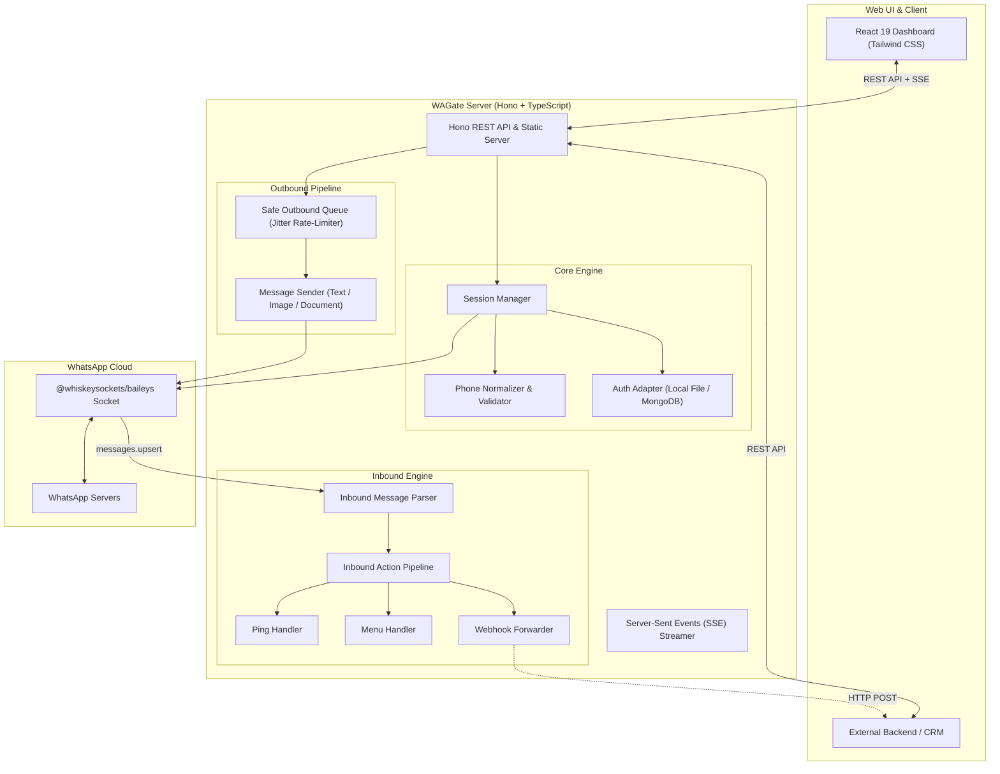

# WAGate 🚀
> High-Performance Multi-Session WhatsApp Gateway & Automation Engine built on Baileys, Hono, React 19, and Oxlint.

[](https://www.typescriptlang.org/)
[](https://hono.dev/)
[](https://react.dev/)
[](https://tailwindcss.com/)
[](https://oxc.rs/)
[](https://vitest.dev/)
[](https://opensource.org/licenses/ISC)

---

## 📌 Overview

**WAGate** is a modern, lightweight, and developer-friendly WhatsApp Gateway engine. Unlike Puppeteer/Selenium-based solutions, WAGate communicates directly via native WebSocket protocol using `@whiskeysockets/baileys`, consuming minimal RAM (<50MB per session) and supporting dozens of simultaneous WhatsApp numbers on a single machine or VPS.

WAGate includes strict phone validation safeguards, an anti-ban persistent outbound queue, modular inbound action handlers, and an integrated real-time single-page web dashboard powered by React 19 and Server-Sent Events (SSE).

---

## 🌟 Key Highlights

1. **Multi-Session Isolation**  
   Run independent WhatsApp numbers concurrently. Each session maintains its own authentication state, socket instance, outbound rate-limiter, and message router.

2. **Strict Phone Number Verification (Anti-Mismatch)**  
   Users must specify their expected WhatsApp number before scanning the QR code. When scanned, WAGate extracts the authenticated JID from credentials. If the number does not match, the session is **immediately aborted, logged out, and purged** to prevent account mix-ups.

3. **Pluggable Auth Storage**  
   - **Local File System**: Fast local development via Baileys `useMultiFileAuthState`.
   - **MongoDB**: Cloud-ready multi-instance clustering using serialized BufferJSON keys in a MongoDB collection.

4. **Anti-Ban Outbound Safe Queue**  
   - Concurrency = 1 per WhatsApp number to strictly avoid burst spam triggers.
   - Randomized jitter interval between messages (default: 1.5s – 3.0s).
   - Live queue inspection API, per-task cancellation, and emergency queue purge (`DELETE /sessions/:sessionId/queue`).

5. **Modular Inbound Message Engine**  
   Pipeline-based `MessageContext` abstraction with built-in action helpers (`reply()`, `replyImage()`, `react()`, `simulateTyping()`, `markRead()`). Easily add commands, chatbots, or forward inbound chats to an external Webhook backend.

6. **Dashboard & API Access Protection (HTTP Basic Auth + API Key)**  
   Keep the web dashboard secure from unauthorized access using built-in HTTP Basic Auth (`DASHBOARD_USER` & `DASHBOARD_PASS`). External systems and scripts can authenticate via `X-Api-Key`, while `/health` remains publicly monitorable.

7. **Single-Port Real-Time Web Dashboard**  
   Built with Vite, React 19, TypeScript, Tailwind CSS v4, Lucide Icons, and linted with lightning-fast **Oxlint**. The backend Hono server serves the compiled dashboard directly, eliminating CORS or multi-port setup issues in production.

8. **Engineered with Strict TDD**  
   All core features, phone normalization, authentication adapters, outbound queues, and REST routes are rigorously verified with **60 automated unit and integration tests** in Vitest.

---

## 🏗️ Architecture



---

## 🚀 Quick Start

### 1. Prerequisites
- **Node.js**: `v20.x` or higher (tested on `v22` & `v26`)
- **npm** or **pnpm**
- **MongoDB** *(optional, only if using MongoDB session storage or message persistence)*

### 2. Installation

Clone repository and install dependencies:
```bash
git clone https://github.com/wardix/wagate.git
cd wagate

# Install root dependencies
npm install

# Install frontend dependencies
cd frontend && npm install && cd ..
```

### 3. Configuration

Copy the example environment configuration:
```bash
cp .env.example .env
```

Edit `.env` as needed:
```env
PORT=3000
API_KEY=secret-token-12345
SESSION_STORAGE=file
SESSIONS_DIR=./sessions
QUEUE_MIN_DELAY_MS=1500
QUEUE_MAX_DELAY_MS=3000
```

### 4. Running the Application

#### Development Mode:
Run backend with live reloads:
```bash
npm run dev
```

Run frontend in standalone Vite dev server (optional):
```bash
npm run dev:frontend
```

#### Production Build & Start:
Build both backend and frontend, then serve via single Hono server on port `3000`:
```bash
npm run build:all
npm run start
```

Access the dashboard at `http://localhost:3000`.

---

## 🧪 Testing & Code Quality

WAGate was built strictly following Test-Driven Development (TDD) principles.

```bash
# Run all Vitest test suites (55 unit & integration tests)
npm run test

# Run tests in interactive watch mode
npm run test:watch

# Run Oxlint on frontend
npm run lint:frontend
```

---

## 📡 REST API Reference

All requests can include an `X-Api-Key: <YOUR_API_KEY>` header if configured.

### Session Management

| Method | Endpoint | Description |
|---|---|---|
| `GET` | `/api/v1/sessions` | List all active sessions and their connection statuses |
| `POST` | `/api/v1/sessions` | Register session with expected phone number (`sessionId`, `expectedPhone`) |
| `GET` | `/api/v1/sessions/:sessionId` | Get single session status and phone pairing detail |
| `POST` | `/api/v1/sessions/:sessionId/restart` | Reconnect/restart disconnected session to trigger new QR code |
| `DELETE` | `/api/v1/sessions/:sessionId` | Logout and delete session credentials |
| `GET` | `/api/v1/sessions/:sessionId/events` | Real-time SSE stream (`qr`, `connection`, `mismatch`, `logout`) |

### Outbound Messages & Queue

| Method | Endpoint | Description |
|---|---|---|
| `POST` | `/api/v1/messages/send-text` | Queue outbound text message (`sessionId`, `to`, `text`) |
| `POST` | `/api/v1/messages/send-media` | Queue outbound media (`sessionId`, `to`, `type`, `url`, `caption`) |
| `GET` | `/api/v1/sessions/:sessionId/queue` | Inspect queued outbound messages for a session |
| `DELETE` | `/api/v1/sessions/:sessionId/queue/:queueId` | Cancel a specific pending message |
| `DELETE` | `/api/v1/sessions/:sessionId/queue` | Emergency clear all pending messages for session |

---

## 🧩 Inbound Action Handlers

Inbound messages pass through a clean chain-of-responsibility pipeline located in `src/inbound/handlers/`.

Example custom handler:
```typescript
import { InboundHandler } from '../handler.interface.js'
import { MessageContext } from '../context.js'

export class HelloHandler implements InboundHandler {
  canHandle(ctx: MessageContext): boolean {
    return ctx.text.trim().toLowerCase() === '!halo'
  }

  async handle(ctx: MessageContext): Promise<void> {
    await ctx.simulateTyping(1000)
    await ctx.reply(`Halo Kak @${ctx.senderPhone}! Selamat datang di WAGate 👋`)
  }
}
```

Register handlers in `src/inbound/message.router.ts`:
```typescript
this.register(new PingHandler())
this.register(new MenuHandler())
this.register(new WebhookHandler())
```

---

## 📁 Project Structure

```text
.
├── frontend/               # React 19 + Vite + Tailwind CSS v4 Dashboard
│   ├── src/
│   │   ├── components/     # UI Modals, Session Cards, Queue Viewer
│   │   ├── App.tsx         # Main Dashboard Layout & State
│   │   └── main.tsx        # React Entry Point
│   ├── vite.config.ts      # Vite 8 Configuration
│   └── package.json        # Frontend Dependencies & Oxlint Script
├── src/
│   ├── api/                # Hono HTTP Routes & Static Server
│   │   ├── routes/         # Session, Message, and Queue Route Modules
│   │   └── server.ts       # Hono App Factory
│   ├── config/             # Environment Configuration
│   ├── core/               # Baileys Socket Engine & Session Lifecycle
│   │   ├── auth/           # File & MongoDB Auth Adapters
│   │   ├── session.instance.ts
│   │   └── session.manager.ts
│   ├── database/           # MongoDB Message Store Adapter
│   ├── inbound/            # Inbound Parser, Context, & Command Handlers
│   ├── outbound/           # Anti-Ban Safe Queue & Message Sender
│   ├── utils/              # Phone Normalization & Format Helpers
│   └── index.ts            # Server Entry Point
├── tests/                  # Vitest Test Suites
│   ├── unit/               # Unit Tests (Phone, Auth, Queue, Handlers)
│   └── integration/        # Hono Integration Tests (Session & Message APIs)
├── PRD.md                  # Comprehensive Product Requirement Document
├── package.json            # Root Scripts & Dependencies
└── README.md               # Project Documentation
```

---

## 📄 License

This project is licensed under the [ISC License](./LICENSE).
